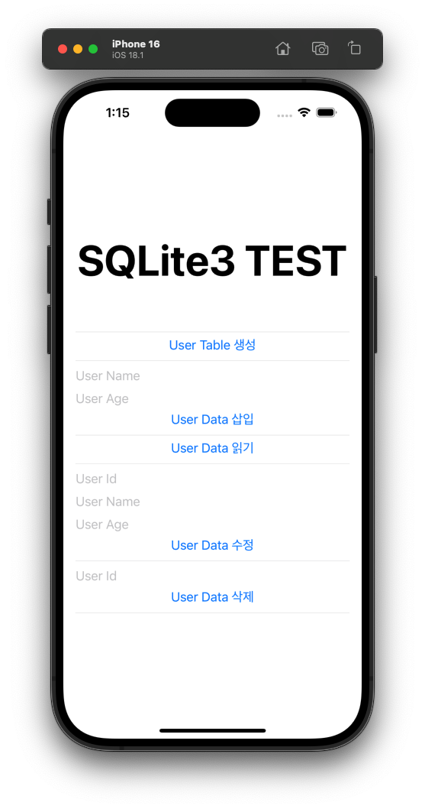
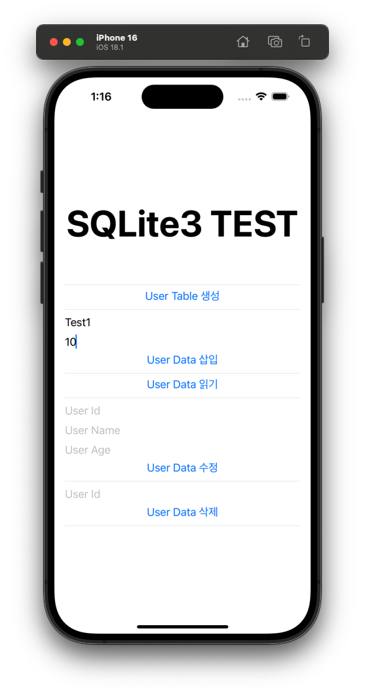
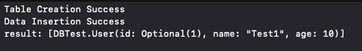

# DBTest – SQLite & GRDB CRUD Example (iOS / SwiftUI)

iOS 환경에서  
- **`SQLite3` 저수준 API를 직접 사용한 CRUD 구현**
- **`GRDB` ORM을 사용한 CRUD 구현**

을 동일한 `User` 모델 기준으로 비교·구현한 예제 프로젝트입니다.

> SQLite 내부 동작 이해부터  
> GRDB Migration / Record 기반의 기본적인 데이터 관리를 정리한 예제 프로젝트입니다.

---

## Features
- Singleton 패턴 기반 DB 관리
- SQLite 파일 기반 로컬 DB
- User 테이블의 CRUD
- 두 가지 구현 방식 제공
  - `SQLiteManager` (SQLite3 직접 사용)
  - `GRDBManager` (GRDB ORM 사용)

---

## User Model

```swift
struct User: Codable, FetchableRecord, MutablePersistableRecord {
    var id: UInt64?
    var name: String
    var age: UInt8
}
```


1. User Table 생성을 누르고,


2. 데이터를 입력 한 뒤, User Data 삽입을 누르면, 데이터베이스에 데이터가 저장됩니다.


3. User Data 읽기를 누르면 데이터베이스에 저장된 데이터가 print됩니다.

